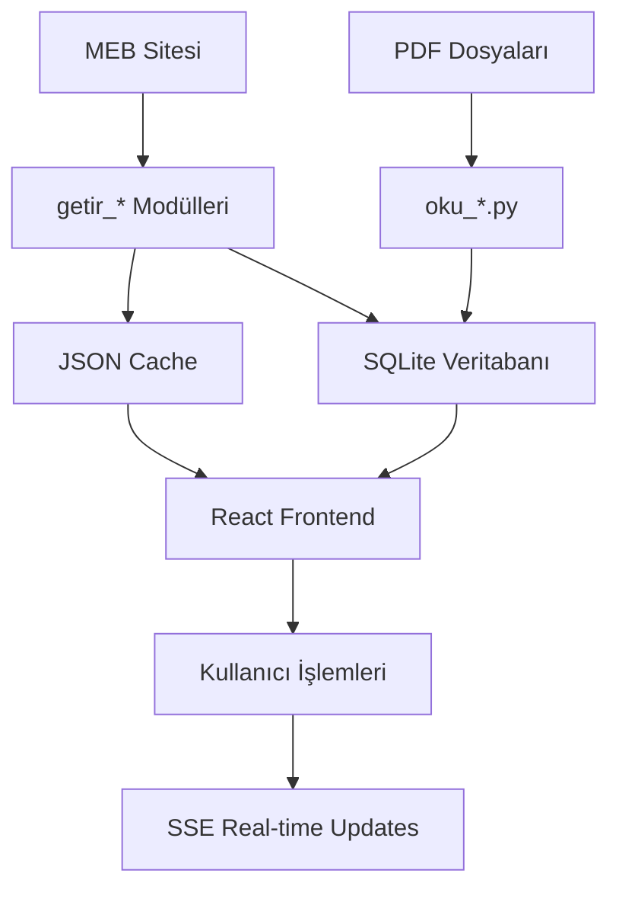

# 🤖 CLAUDE.md - MEB Mesleki Eğitim Veri İşleme Projesi - Birleşik Kılavuz

Bu dosya, Claude Code için MEB Mesleki Eğitim Veri İşleme ve Veritabanı Projesinin kapsamlı birleşik kılavuzudur. README.md, is_akisi.md ve teknik detayların tümünü içerir. Proje mantığını koruyarak her seferinde hata yapmaktan kaçınmak için tüm kritik bilgileri içerir.

**Son Güncelleme**: 2025-07-15

## 🎯 Proje Genel Bakış

### Ana Amaç
Türkiye Cumhuriyeti Millî Eğitim Bakanlığı'na (MEB) bağlı Mesleki ve Teknik Eğitim Genel Müdürlüğü'nün web sitesinden (`meslek.meb.gov.tr`) mesleki eğitim verilerini otomatik olarak çeker, işler ve SQLite veritabanında yapılandırılmış şekilde saklar.

### Sistem Mimarisi
**3 Katmanlı Sistem:**
1. **Backend (Flask + SQLite):** Veri çekme, PDF işleme ve veritabanı yönetimi
2. **Frontend (React):** Aşamalı iş akışı ile kullanıcı arayüzü  
3. **Veritabanı (SQLite):** Hiyerarşik eğitim verilerinin yapılandırılmış saklanması

### Hiyerarşik Veri Yapısı
```
Alan (Area) → Dal (Field) → Ders (Course) → Öğrenme Birimi (Learning Unit) → Konu (Topic) → Kazanım (Achievement)
```

## 📁 Kritik Dosya Yapısı

### 🔧 Core Backend Dosyaları
- **`server.py`** - Ana Flask sunucusu, tüm API endpoint'leri, veritabanı işlemleri ve **istatistik sistemi**
  - ⭐ **YENİ**: Merkezi database connection decorator sistemi kullanıyor

### 📊 Backend Modülleri (modules/ klasörü)
- **`modules/oku_dbf.py`** - ⭐ **YENİDEN ADLANDIRILDI**: DBF PDF parsing ve içerik analizi (eski: oku.py)
- **`modules/getir_dbf.py`** - Ders Bilgi Formları (DBF) verilerini çeker, RAR/ZIP dosyalarını indirir ve açar
- **`modules/getir_cop.py`** - ⭐ **GÜNCEL**: ÇÖP (Çerçeve Öğretim Programı) linklerini çeker ve utils.py ile indirir
- **`modules/oku_cop.py`** - ⭐ **YENİ**: COP PDF parsing ve analiz modülü - Tamamen yeniden yazıldı
- **`modules/getir_cop_oku_local.py`** - ⭐ **YENİ**: Yerel PDF dosyalarını test etmek için standalone ÇÖP okuma modülü
- **`modules/getir_dm.py`** - Ders Materyalleri (DM) verilerini çeker
- **`modules/getir_bom.py`** - Bireysel Öğrenme Materyalleri (BÖM) verilerini çeker
- **`modules/getir_dal.py`** - Alan-Dal ilişkilerini çeker
- **`modules/utils.py`** - ⭐ **GÜNCELLENDİ**: Yardımcı fonksiyonlar, Türkçe karakter normalizasyonu, **merkezi PDF cache yönetimi** ve **database connection decorators**

### 🌐 Frontend Dosyaları
- **`src/App.js`** - ⭐ **YENİLENDİ**: Tek satır workflow UI, console panel, JSON popup'sız tasarım
- **`src/App.css`** - Ana stil dosyası
- **`package.json`** - Node.js bağımlılıkları ve scriptler
- **`src/index.js`** - React uygulaması entry point
- **`src/setupProxy.js`** - CORS proxy ayarları
- **`src/reportWebVitals.js`** - Performance monitoring

### 🗂️ Veri ve Veritabanı
- **`data/temel_plan.db`** - SQLite veritabanı dosyası
- **`data/schema.sql`** - Veritabanı schema dosyası
- **`data/`** - JSON cache dosyaları, veritabanı ve schema dosyaları
  - `dbf/` - İndirilen DBF dosyaları (alan klasörleri halinde)
  - `cop/` - ÇÖP PDF dosyaları
  - `dm/` - Ders Materyali dosyaları
  - `bom/` - BÖM dosyaları

### 🐛 Debug ve Test Araçları
- **`test.py`** - DBF PDF tablo yapısını detaylı analiz eden debug script

## 🗄️ Veritabanı Yapısı (SQLite)

### Ana Tablolar
```sql
-- 1. ALANLAR (Ana Eğitim Alanları)
temel_plan_alan
├── id (INTEGER PRIMARY KEY)
├── alan_adi (TEXT NOT NULL)
├── meb_alan_id (TEXT)
├── cop_url (TEXT) - ÇÖP URL'leri (JSON format)
├── dbf_urls (TEXT) - DBF URL'leri (JSON format)
├── created_at, updated_at (TIMESTAMP)

-- 2. DALLAR (Meslek Dalları)
temel_plan_dal
├── id (INTEGER PRIMARY KEY)
├── dal_adi (TEXT NOT NULL)
├── alan_id (INTEGER) → temel_plan_alan.id (FOREIGN KEY)
├── created_at, updated_at (TIMESTAMP)

-- 3. DERSLER (Ders Listesi)
temel_plan_ders
├── id (INTEGER PRIMARY KEY)
├── ders_adi (TEXT NOT NULL)
├── sinif (INTEGER) - Sınıf seviyesi (9, 10, 11, 12)
├── ders_saati (INTEGER NOT NULL DEFAULT 0)
├── amac (TEXT) - DBF PDF ten okunan dersin amacı metni
├── dm_url (TEXT) - Ders Materyali PDF URL'si
├── dbf_url (TEXT) - DBF yerel dosya yolu
├── bom_url (TEXT) - BÖM URL'si
├── created_at, updated_at (TIMESTAMP)

-- 4. DERS-DAL İLİŞKİLERİ (Many-to-Many)
temel_plan_ders_dal
├── id (INTEGER PRIMARY KEY)
├── ders_id (INTEGER) → temel_plan_ders.id
├── dal_id (INTEGER) → temel_plan_dal.id
├── created_at (TIMESTAMP)

-- Diğer tablolar: temel_plan_ogrenme_birimi, temel_plan_konu, 
-- temel_plan_kazanim, temel_plan_arac, temel_plan_olcme, vb. bunların hepsi DBF PDF ten oku_dbf.py ile alınır.
```

## 🔄 Aşamalı İş Akışı

### 🚀 Adım 1: Temel Veri Çekme

**Dosya**: `modules/getir_dal.py`
**Fonksiyon**: `getir_dal_with_db_integration()`

**Amaç**: Türkiye'deki tüm illerdeki okullara göre mesleki eğitim alanları ve dallarını toplar.

**İşlem Akışı**:

İşler öncelikle getir_dal.py ile başlar. Bu modül aşağıdaki işlemler ile Alan ve Dal bilgilerini çeker.

1. **İl Listesi Çekme**
   - Endpoint: `https://mtegm.meb.gov.tr/kurumlar/api/getIller.php`
   - Türkiye'deki 81 il bilgisini çeker

2. **Alan Listesi Çekme** (Her il için)
   - Endpoint: `https://mtegm.meb.gov.tr/kurumlar/api/getAlanlar.php`
   - POST data: `{"k_ilid": il_id}`
   - Her ilin mesleki eğitim alanlarını çeker

3. **Dal Listesi Çekme** (Her alan için)
   - Endpoint: `https://mtegm.meb.gov.tr/kurumlar/api/getDallar.php`
   - POST data: `{"k_ilid": il_id, "alan": alan_value}`
   - Her alanın alt dallarını çeker

4. **Veri Standardizasyonu**
   - `utils.normalize_to_title_case_tr()` ile Türkçe metin normalizasyonu
   - Tekrar eden alan/dal kontrolü

5. **Veritabanı Kaydetme**
   - `temel_plan_alan` tablosuna alanlar
   - `temel_plan_dal` tablosuna dallar (alan_id ile ilişkili)
   - Benzersizlik kontrolü ile duplicate önleme

6. **Dosya Organizasyonu**
   - `data/alan/{alan_adi}/dallar/dallar.json` yapısında yedek dosyalar
   - Her alan için klasör yapısı oluşturma

**Çıktılar**:
- Veritabanında alan/dal kayıtları
- `data/getir_dal_sonuc.json` yedek dosyası
- `data/alan/` klasör yapısı

**Performans**:
- 81 il × ortalama 50 alan × ortalama 3 dal ≈ 12,000 API çağrısı
- Rate limiting: 0.3s/dal, 1.5s/il
- Session yönetimi ile çerez korunumu

### 📄 Adım 2: Çerçeve Öğretim Programı (ÇÖP) İşleme - İki Modüllü Sistem

**Ana Modüller**:
- **`modules/getir_cop.py`** - ÇÖP linklerini çeker ve utils.py ile indirir
- **`modules/oku_cop.py`** - İndirilen PDF'leri okur ve analiz eder

**İşlem Akışı**:

#### 2A. ÇÖP Linkleri ve İndirme (`getir_cop.py`)

1. **MEB Alan ID Güncelleme**
   - `update_meb_alan_ids()` fonksiyonu ile MEB'den alan ID'leri çeker
   - Veritabanındaki alanları MEB sistemi ile eşleştirir
   - `temel_plan_alan.meb_alan_id` sütununu günceller

2. **ÇÖP URL Tarama** (Paralel işlem)
   - Endpoint: `https://meslek.meb.gov.tr/cercevelistele.aspx`
   - Her sınıf için (9, 10, 11, 12) ÇÖP listesi çeker
   - BeautifulSoup ile HTML ayrıştırma
   - PDF linklerini ve güncelleme yıllarını çıkarır

3. **Merkezi PDF İndirme**
   - `utils.py`'deki `download_and_cache_pdf()` fonksiyonu kullanılır
   - `data/cop/{ID:02d}_{alan_adi}/` formatında ID bazlı klasör yapısı
   - **Dosya adı değiştirilmez** (orijinal MEB dosya adı korunur)
   - Mevcut dosya kontrolü (gereksiz indirmeleri önleme)

4. **Metadata Kaydetme**
   - Her alan için `cop_metadata.json` dosyası
   - ÇÖP bilgileri `temel_plan_alan.cop_url` sütununda JSON format

#### 2B. ÇÖP PDF Okuma ve Analiz (`oku_cop.py`)

1. **PDF İçerik Analizi**
   - `oku_cop_pdf_file()` ana parsing fonksiyonu
   - `pdfplumber` ile PDF metin çıkarma
   - Encoding-safe Türkçe karakter işleme

2. **Alan-Dal-Ders İlişkisi Çıkarma**:
   - **Tablo Başlığı Tabanlı Alan/Dal Tespiti**: HAFTALIK DERS ÇİZELGESİ başlıklarından okuma
   - **Adjacent Column Search**: Header-data mismatch'leri için ±2 sütun arama algoritması
   - **MESLEK DERSLERİ Tablolarından**: Ders listesi, sınıf ve ders saati çıkarma
   - **Smart Filtering**: TOPLAM ve REHBERLİK satırları otomatik filtreleme

3. **Veritabanı Entegrasyonu**
   - `save_cop_results_to_db()` fonksiyonu
   - Çıkarılan ders bilgileri `temel_plan_ders` tablosuna eklenir
   - `temel_plan_ders_dal` ilişki tablosu güncellenir
   - Otomatik dal oluşturma (gerekirse)

4. **Toplu İşleme**
   - `oku_tum_pdfler()` dizindeki tüm PDF'leri işler
   - Real-time progress reporting
   - Clickable output: Terminal'de tıklanabilir PDF yolları

**Çıktılar**:
- İndirilmiş ÇÖP PDF dosyaları (`data/cop/` klasöründe)
- Veritabanında ders kayıtları
- `data/getir_cop_sonuc.json` yedek dosyası
- Alan bazında metadata dosyaları

**Performans**:
- 4 sınıf × 50 alan ≈ 200 PDF dosyası
- Paralel indirme (ThreadPoolExecutor)
- PDF okuma: pdfplumber kütüphanesi
- Memory efficient: geçici dosya kullanımı

### 💾 Adım 3: DBF (Ders Bilgi Formu) İşleme

**Dosya**: `modules/getir_dbf.py`
**Amaç**: Ders Bilgi Formu (DBF) verilerini çeker, indirip açar ve içeriklerini analiz eder.

**Kaynak URL**: `https://meslek.meb.gov.tr/dbflistele.aspx`

**İşlem Akışı**:

1. **DBF Link Çekme**
   - `getir_dbf(siniflar)` - DBF linklerini çeker
   - Sınıf bazında (9, 10, 11, 12) alan-DBF matrisi

2. **Dosya İndirme ve Açma**
   - `download_and_extract_dbf()` - İndirir ve açar
   - RAR/ZIP otomatik açma (`rarfile`, `zipfile`)
   - Progress tracking ile SSE desteği
   - Retry mekanizması

3. **İçerik Analizi** (⭐ **YENİ**)
   - `scan_dbf_files_and_extract_courses()` - İçerik analizi
   - `extract_course_name_from_dbf()` - PDF'den ders adı (⭐ **YENİ**)
   - **YENİ**: PDF içeriğinden gerçek ders adı çıkarma (fuzzy matching yerine)

4. **Dosya Organizasyonu**
```
data/dbf/
├── {ID:02d}_{Alan_Adi}/
│   ├── alan.rar (orijinal)
│   ├── alan/ (açılmış)
│   │   ├── 9.SINIF/
│   │   ├── 10.SINIF/
│   │   └── 11.SINIF/
```

### 💾 Adım 4: Veritabanı Güncellemeleri
- **DBF Eşleştir:** İndirilen dosyalarle dersleri eşleştir
- **Ders Saatlerini Güncelle:** DBF'lerden ders saati bilgilerini çıkar (`modules/oku_dbf.py`)
- **Veritabanına Aktar:** Düzenlenmiş dersleri kaydet

## 📊 Ek Veri Modülleri

### DM (Ders Materyali) İşleme
**Dosya**: `modules/getir_dm.py`
**Kaynak URL**: 
- `https://meslek.meb.gov.tr/cercevelistele.aspx` (Alan listesi)
- `https://meslek.meb.gov.tr/dmgoster.aspx` (DM listesi)

**Kritik Mantık**:
- Sınıf → Alan → Ders hiyerarşisi
- Dinamik alan ID'lerini HTML'den çıkarma
- Fuzzy matching ile veritabanı eşleştirmesi

### BÖM (Bireysel Öğrenme Materyali) İşleme
**Dosya**: `modules/getir_bom.py`
**Kaynak URL**: `https://meslek.meb.gov.tr/moduller`

**Kritik Özellikler**:
- ASP.NET form işleme (ViewState yönetimi)
- 3 aşamalı form gönderimi (Ana sayfa → Alan seç → Ders seç)
- Paralel işleme (5 worker)
- Session yönetimi

## 📋 Modül Detayları ve Kritik Bilgiler

### 1. 📄 oku_cop.py - ⭐ **TAMAMEN YENİDEN YAZILDI**

**Amaç:** Yerel COP (Çerçeve Öğretim Programı) PDF dosyalarını analiz ederek alan, dal ve ders bilgilerini çıkarır.

**🚀 Yeni Mimari Özellikleri:**
- **Tablo Başlığı Tabanlı Alan/Dal Tespiti**: İçindekiler yerine HAFTALIK DERS ÇİZELGESİ başlıklarından okuma
- **Adjacent Column Search**: Header-data mismatch'leri için ±2 sütun arama algoritması  
- **Encoding-Safe Processing**: Türkçe karakter sorunları için robust algılama
- **Smart Filtering**: TOPLAM ve REHBERLİK satırları otomatik filtreleme
- **Clickable Output**: Terminal'de tıklanabilir PDF yolları

**Ana Fonksiyonlar:**
- `extract_alan_dal_from_table_headers(pdf)` - ⭐ **YENİ**: Tablo başlıklarından alan/dal tespiti
- `parse_schedule_table(table)` - ⭐ **İYİLEŞTİRİLDİ**: Gelişmiş tablo parsing + multi-row header desteği
- `find_dal_name_for_schedule(lines, index)` - Dal-tablo eşleştirmesi  
- `extract_ders_info_from_schedules(pdf)` - ⭐ **İYİLEŞTİRİLDİ**: Ders bilgilerini tablolardan çıkarma
- `oku_cop_pdf_file(pdf_path)` - ⭐ **YENİ**: Ana parsing fonksiyonu
- `oku_tum_pdfler(root_dir)` - Toplu PDF işleme

**🔧 Kritik İyileştirmeler:**

**1. Alan/Dal Tespiti:**
```python
# Eski: İçindekiler bölümünden (güvenilmez)
# Yeni: HAFTALIK DERS ÇİZELGESİ üstündeki başlıklardan
"KUYUMCULUK TEKNOLOJİSİ ALANI"     → Alan: Kuyumculuk Teknolojisi  
"(TAKI İMALATI DALI)"              → Dal: Takı İmalatı
```

**2. Adjacent Column Search:**
```python
# Header detection: DERSLER sütunu index 3'te
# Data rows: Ders adları index 2'de
# Çözüm: ±2 offset ile arama [0, -1, 1, -2, 2]
```

**3. Encoding-Safe MESLEK DERSLERİ:**
```python
if ("MESLEK DERSLERİ" in kategori_cell or 
    "MESLEKİ DERSLER" in kategori_cell or
    "MESLEK DERSLER" in kategori_cell or
    "MESLEK" in kategori_cell and ("DERS" in kategori_cell)):
```

**4. Smart Filtering:**
```python
# Ders olmayan satırları filtrele
if ("TOPLAM" in potential_upper or 
    "REHBERLİK" in potential_upper and "YÖNLENDİRME" in potential_upper):
    continue  # Atla
```

**📊 Performans Sonuçları:**
- **gemi_11**: 0 → 28 ders (+∞% iyileştirme)
- **bilisim_12**: 0 → 21 ders (+∞% iyileştirme)  
- **kuyumculuk_10**: 0 → 12 ders (+∞% iyileştirme)
- **gida_12**: 0 → 17 ders (+∞% iyileştirme)

**🎯 Output Formatı:**
```
🎯 SONUÇLAR ÖZET:
   📁 PDF: data/cop/kuyumculuk_10/kuyumculuk_10_cop_program.pdf
   📚 Alan Adı: Kuyumculuk Teknolojisi
   🏭 Dal Sayısı: 1
   📖 Toplam Ders Sayısı: 12
```

### 2. 📄 getir_dbf.py

**Amaç:** Ders Bilgi Formu (DBF) verilerini çeker, indirip açar ve içeriklerini analiz eder.

**Kaynak URL:** `https://meslek.meb.gov.tr/dbflistele.aspx`

**Dosya Organizasyonu:**
```
data/dbf/
├── {ID:02d}_-_{Alan_Adi}/
│   ├── alan.rar (orijinal)
│   ├── alan/ (açılmış)
│   │   ├── 9.SINIF/
│   │   ├── 10.SINIF/
│   │   └── 11.SINIF/

Örnek:
├── 01_-_Adalet/
├── 03_-_Bilişim_Teknolojileri/
└── 04_-_Biyomedikal_Cihaz_Teknolojileri/
```

**Kritik Özellikler:**
- RAR/ZIP otomatik açma (`rarfile`, `zipfile`)
- **YENİ**: PDF içeriğinden gerçek ders adı çıkarma (fuzzy matching yerine)
- Progress tracking ile SSE desteği
- Retry mekanizması

**Ana Fonksiyonlar:**
- `getir_dbf(siniflar)` - DBF linklerini çeker
- `download_and_extract_dbf()` - İndirir ve açar
- `scan_dbf_files_and_extract_courses()` - İçerik analizi (YENİ)
- `extract_course_name_from_dbf()` - PDF'den ders adı (YENİ)


### 6. 📄 oku_dbf.py ⭐ **YENİDEN ADLANDIRILDI**

**Amaç:** DBF PDF parsing ve içerik analizi (eski: oku.py).

**🔧 Kritik İyileştirmeler:**
- **Daha İyi Amaç Çıkarma**: `_is_valid_amac_content()` ile 10+ kelime validasyonu
- **Kazanım Eşleştirme Düzeltmesi**: Newline karakterleri için robust handling
- **Temizlik**: Kullanılmayan fonksiyonlar kaldırıldı, sadece DBF işleme odaklı

**Desteklenen Formatlar:**
- PDF (`pdfplumber`)
- DOCX (`python-docx`)

**Ana Fonksiyonlar:**
- `oku_dbf()` - Ana DBF parsing fonksiyonu (eski: oku)
- `extract_ders_adi()` - Dosyadan ders adını çıkarır
- `extract_text_from_pdf()` - PDF metin çıkarma
- `extract_text_from_docx()` - DOCX metin çıkarma

### 7. 📄 getir_cop_oku_local.py ⭐ **YENİ**

**Amaç:** Yerel PDF dosyalarını test etmek için standalone ÇÖP okuma modülü.

**Özellikler:**
- Kök dizindeki PDF dosyalarını otomatik tarar
- `modules/getir_cop_oku.py`'deki fonksiyonları kullanır (kod tekrarı yok)
- Stand-alone çalışma desteği (import hatası durumunda sys.path yönetimi)
- Terminal çıktısında detaylı analiz sonuçları

**Ana Fonksiyonlar:**
- `extract_alan_dal_ders_from_cop_file(pdf_path)` - Yerel PDF'den veri çıkarma
- `oku_cop_pdf_file(pdf_path)` - Tek PDF dosyasını okuma
- `oku_tum_pdfler(root_dir)` - Dizindeki tüm PDF'leri toplu okuma

**Kullanım:**
```bash
# Script olarak çalıştırma
python modules/getir_cop_oku_local.py

# Modül olarak kullanma
from modules.getir_cop_oku_local import oku_cop_pdf_file
result = oku_cop_pdf_file("test.pdf")
```

### 8. 📄 utils.py - PDF Cache Yönetimi ⭐ **YENİ**

**Amaç:** Merkezi PDF indirme ve cache yönetimi sistemi.

**Yeni Fonksiyonlar:**
- `download_and_cache_pdf(url, cache_type, alan_adi, additional_info)` - Organize PDF cache sistemi
- `get_temp_pdf_path(url)` - Geçici dosya yolu oluşturma

**Cache Yapısı:** ⭐ **GÜNCEL ID Bazlı Organizasyon**
```
data/
├── cop/     # Çerçeve Öğretim Programları
│   └── {ID:02d}_{alan_adi}/
│       └── [orijinal_dosya_adi].pdf
├── dbf/     # Ders Bilgi Formları  
│   └── {ID:02d}_{alan_adi}/
│       └── {alan}_dbf_package.rar
├── dm/      # Ders Materyalleri
│   └── {ID:02d}_{alan_adi}/
│       └── sinif_{sinif}/
│           └── {ders_id:03d}_{ders_adi}.pdf
└── bom/     # Bireysel Öğrenme Materyalleri
    └── {ID:02d}_{alan_adi}/
        └── {ders_id:03d}_{ders_adi}/
            └── {modul}.pdf

Örnek:
├── 03_Bilişim_Teknolojileri/
│   ├── bilisim_teknolojileri_cop_9_sinif.pdf
│   ├── sinif_9/
│   │   ├── 001_Programlama_Temelleri.pdf
│   │   └── 002_Bilgisayar_Donanım.pdf
│   └── 001_Programlama_Temelleri/
│       ├── Modül_01_Temel_Kavramlar.pdf
│       └── Modül_02_Uygulama.pdf
```

**Avantajları:**
- Kod tekrarı önleme
- Organize dosya yapısı
- Otomatik cache kontrolü
- Güvenli dosya adlandırma

### 9. 📄 Database Connection Decorators ⭐ **YENİ**

**Amaç:** Merkezi database connection yönetimi ve kod tekrarını önleme.

**Yeni Fonksiyonlar:**
- `@with_database_json` - Flask endpoint'leri için decorator
- `@with_database` - Genel fonksiyonlar için decorator  
- `find_or_create_database()` - Otomatik database/schema kurulumu

**🔧 Kritik Özellikler:**

**1. Flask Endpoint Decorator:**
```python
@app.route('/api/endpoint')
@with_database_json
def my_endpoint(cursor):
    cursor.execute("SELECT * FROM table")
    return {"data": cursor.fetchall()}  # Otomatik JSON response
```

**2. Genel Fonksiyon Decorator:**
```python
@with_database
def my_function(cursor, param1, param2):
    cursor.execute("INSERT INTO table VALUES (?, ?)", (param1, param2))
    return {"success": True}
```

**3. Standardize Error Handling:**
```python
# CLAUDE.md uyumlu format
{
  "success": false,
  "error": "Error message",
  "error_type": "database", 
  "timestamp": "2025-07-15T10:30:00Z"
}
```

**📊 Performans İyileştirmesi:**
- **Öncesi**: 32 tekrarlı database connection pattern
- **Sonrası**: Tek decorator ile merkezi yönetim
- **Row Factory**: `sqlite3.Row` ile dict-style access
- **Auto-commit**: Transaction yönetimi dahili

## 🔌 API Endpoints - Detaylı Referans

### 📥 Temel Veri Çekme
- **`GET /api/get-cached-data`** - Önbellekteki JSON verilerini getir
  - Response: Tüm modüllerin cache dosyalarından toplanan veriler
  - Headers: `application/json`
  
- **`GET /api/scrape-to-db`** - MEB'den veri çek ve DB'ye kaydet
  - Method: Server-Sent Events (SSE)
  - Response: Real-time progress updates
  - Headers: `text/event-stream`
  
- **`POST /api/process-pdf`** - PDF dosyasını işle
  - Method: Server-Sent Events (SSE) 
  - Body: `{"pdf_path": "/path/to/file.pdf"}`
  - Response: PDF işleme progress updates

### 📊 Kategorik Veri Endpoint'leri
- **`GET /api/get-dbf`** - DBF (Ders Bilgi Formu) verilerini getir
  - Response: DBF linkları, dosya durumları, alan organizasyonu
  - Cache: `data/getir_dbf_sonuc.json`
  
- **`GET /api/get-cop`** - ÇÖP (Çerçeve Öğretim Programı) linklerini çeker ve veritabanına kaydeder
  - Method: Server-Sent Events (SSE)
  - Response: Real-time progress updates
  - Process: MEB'den ÇÖP linklerini çeker → URL'leri veritabanına JSON formatında kaydeder → PDF'leri indirir
  
- **`GET /api/get-dm`** - DM (Ders Materyali) verilerini getir
  - Response: Ders materyali PDF linkları, sınıf-alan-ders hiyerarşisi
  - Cache: `data/getir_dm_sonuc.json`
  
- **`GET /api/get-bom`** - BÖM (Bireysel Öğrenme Materyali) verilerini getir
  - Response: BÖM modülleri, alan-ders-modül organizasyonu
  - Cache: `data/getir_bom_sonuc.json`
  
- **`GET /api/get-dal`** - Alan-Dal ilişkilerini getir
  - Response: 81 il bazında alan-dal matrisi
  - Cache: `data/getir_dal_sonuc.json`

### 📈 İstatistik ve Monitoring
- **`GET /api/get-statistics`** - ⭐ **YENİ**: Gerçek zamanlı sistem istatistikleri
  - Response: Database kayıt sayıları + disk dosya sayıları
  - Real-time: Veritabanı sorguları + dosya sistemi taraması
  - Format:
    ```json
    {
      "database": {
        "alanlar": 58,
        "dallar": 180,
        "dersler": 800
      },
      "files": {
        "dbf_files": 245,
        "cop_files": 89,
        "dm_files": 456
      }
    }
    ```

### 🔄 PDF ve DBF İşleme Operasyonları
- **`GET /api/dbf-download-extract`** - DBF dosyalarını toplu indir ve aç
  - Method: Server-Sent Events (SSE)
  - Process: RAR/ZIP indirme → Açma → Klasörleme
  - Response: Real-time download/extract progress
  
- **`GET /api/dbf-retry-extract-all`** - Başarısız DBF'leri tekrar aç
  - Method: Server-Sent Events (SSE)
  - Process: Açılmamış dosyaları yeniden işleme
  - Retry Logic: Exponential backoff
  
- **`GET /api/oku-cop`** - ÇÖP PDF'lerini analiz et ve DB'ye kaydet
  - Method: Server-Sent Events (SSE)
  - Process: PDF okuma → İçerik analizi → Veritabanı kaydetme
  - Uses: `modules/oku_cop.py`
  
- **`POST /api/update-ders-saatleri-from-dbf`** - DBF'lerden ders saatlerini güncelle
  - Method: Server-Sent Events (SSE)
  - Process: DBF PDF okuma → Ders saati çıkarma → DB güncelleme
  - Uses: `modules/oku_dbf.py`

### 🗄️ Veritabanı Yönetimi
- **`POST /api/dbf-match-refresh`** - DBF-Ders eşleştirmesini güncelle
  - Body: Manual eşleştirme kuralları
  - Process: Fuzzy matching → Manuel override → DB update
  
- **`POST /api/export-to-database`** - Düzenlenmiş dersleri veritabanına aktar
  - Body: Cleaned/processed ders veriler
  - Process: Validation → Conflict resolution → Bulk insert
  - Transaction: ACID compliant

### 🔧 İş Akışı Entegrasyonu

**Adım 1 - Temel Veri:**
```bash
/api/get-dal          # Alan-Dal çekme
/api/get-cop          # ÇÖP linklerini çekme ve veritabanına kaydetme
/api/get-dbf          # DBF linklerini çekme
/api/get-dm           # DM linklerini çekme
/api/get-bom          # BÖM linklerini çekme
```

**Adım 2 - PDF İşleme:**
```bash
/api/oku-cop                  # ÇÖP PDF lerini okur
/api/dbf-download-extract     # DBF indir/aç
/api/update-ders-saatleri     # Ders saatleri
```

**Adım 3 - DB Güncellemeleri:**
```bash
/api/dbf-match-refresh        # Eşleştirme
/api/export-to-database       # DB'ye aktar
/api/get-statistics           # Sonuç kontrolü
```

### 🚨 Error Handling

Tüm endpoint'ler standardize error response kullanır:
```json
{
  "success": false,
  "error": "Error message",
  "error_type": "validation|network|processing|database",
  "timestamp": "2025-07-15T10:30:00Z"
}
```

**SSE Error Format:**
```
data: {"type": "error", "message": "Error description", "error_type": "network"}
```

## 🚨 Kritik Hatalardan Kaçınma Kuralları

### 1. Database Connection ⭐ **YENİ KURAL**
- **ASLA** manuel `sqlite3.connect()` kullanma
- **MUTLAKA** `utils.py`'deki decorator'ları kullan:
  ```python
  # ✅ Doğru - Flask endpoint'leri için
  @app.route('/api/endpoint')
  @with_database_json
  def my_endpoint(cursor):
      cursor.execute("SELECT * FROM table")
      return {"data": cursor.fetchall()}
  
  # ✅ Doğru - Genel fonksiyonlar için
  @with_database
  def my_function(cursor, params):
      cursor.execute("INSERT...")
      return result
  
  # ❌ Yanlış - Manuel connection
  with sqlite3.connect(db_path) as conn:
      cursor = conn.cursor()
  ```

### 2. Modül İsimleri ⭐ **GÜNCELLENDİ**
- ⚠️ **`oku.py` artık `oku_dbf.py` oldu!**
- Import'larda doğru modül adını kullan:
  ```python
  from modules.oku_dbf import oku_dbf, extract_ders_adi  # ✅ Doğru
  from modules.oku import oku  # ❌ Eski, artık yok
  ```

### 3. UI Tasarımı ⭐ **YENİ KURAL**
- **ASLA** JSON popup/display ekranları ekleme
- Tüm veri gösterimleri console panel'de olmalı
- Button istatistikleri database + disk dosyalarından otomatik yüklenmeli (`/api/get-statistics`)
- Real-time logging için SSE kullan
- Aşamalı iş akışı UI ile organize edilmiş 3-adımlı süreç

### 4. Veritabanı İşlemleri
- **ASLA** veritabanı dosyasını silme
- Migration'ları `schema.sql`'den uygula
- `IF NOT EXISTS` kullan
- Transaction'ları `with sqlite3.connect()` ile yönet

### 5. PDF İşleme
- Content-based matching kullan (fuzzy matching yerine)
- `modules/oku_dbf.py`'yi DBF PDF okuma için kullan (eski: oku.py)
- Encoding: `UTF-8` ile dosya okuma/yazma

### 6. Error Handling
- Her API çağrısında try-catch kullan
- SSE mesajlarında error type belirt
- Timeout değerlerini koru (10-20 saniye)

### 7. Dosya Yolları
- **ASLA** hard-coded path kullanma
- `os.path.join()` ile platform-agnostic yollar
- `data/` klasörü yapısını koru

## 🔧 Geliştirme Ortamı

### Python Bağımlılıkları
```python
# Core
flask
sqlite3 (built-in)
requests
beautifulsoup4

# PDF İşleme
pdfplumber
python-docx

# Archive İşleme
rarfile
zipfile (built-in)

# Utilities
fuzzywuzzy  # (optional, legacy)
```

### Frontend
```javascript
// React
react
react-dom

// Styling
CSS3 (responsive)

// Real-time
Server-Sent Events (SSE)
```

## 🏗️ Sistem Mimarisi Detayları

Proje **3 temel katmandan** oluşur:

1. **🔧 Backend (Flask + SQLite):** Veri çekme, PDF işleme ve veritabanı yönetimi
2. **🌐 Frontend (React):** Aşamalı iş akışı ile kullanıcı arayüzü  
3. **📊 Veritabanı (SQLite):** Hiyerarşik eğitim verilerinin yapılandırılmış saklanması

### Hiyerarşik Veri Yapısı
```
Alan (Area) → Dal (Field) → Ders (Course) → Öğrenme Birimi (Learning Unit) → Konu (Topic) → Kazanım (Achievement)
```

## 🚀 Kurulum ve Çalıştırma

### Gereksinimler
- Python 3.8+
- Node.js 16+
- SQLite3

### 1. Backend Kurulumu
```bash
# Python sanal ortam oluştur
python -m venv venv
source venv/bin/activate  # macOS/Linux
# venv\Scripts\activate   # Windows

# Bağımlılıkları yükle
pip install -r requirements.txt

# Flask sunucusu başlat
python server.py
```

### 2. Frontend Kurulumu
```bash
# Node.js bağımlılıklarını yükle
npm install

# React dev server başlat
npm start
```

## 📊 Veri Akışı



## 🎯 Çekilen Veri Türleri

- **🏢 Alanlar:** Mesleki eğitim alanları (58 alan)
- **🎓 Dallar:** Meslek dalları (alan başına 1-8 dal)
- **📚 Dersler:** Ders listesi ve detayları
- **📄 DBF:** Ders Bilgi Formları (RAR/ZIP dosyaları)
- **📋 ÇÖP:** Çerçeve Öğretim Programları (PDF dosyaları)
- **📖 DM:** Ders Materyalleri (PDF linkleri)
- **📚 BÖM:** Bireysel Öğrenme Materyalleri

## 📈 Performans ve İstatistikler

### Veri Hacmi
- **58 Meslek Alanı**
- **~180 Dal**
- **~800 Ders**
- **~2000 DBF dosyası**
- **~1200 BÖM modülü**

### Performans Metrikleri
- **DBF İndirme**: ~50 MB/dakika
- **ÇÖP İşleme**: ~4 saniye (paralel)
- **DM Çekme**: ~30 saniye
- **BÖM Çekme**: ~45 saniye (ASP.NET karmaşıklığı)
- **Dal Çekme**: ~5 dakika (81 il taraması)

## 🏆 Özellikler

- ✅ **Real-time Progress:** SSE ile canlı işlem takibi
- ✅ **Aşamalı İş Akışı:** Organize edilmiş 3-adımlı süreç  
- ✅ **Otomatik PDF İşleme:** Batch PDF analizi
- ✅ **Hata Toleransı:** Başarısız işlemler için retry mekanizması
- ✅ **Veritabanı Tabanlı:** SQLite ile yapılandırılmış veri saklama
- ✅ **Responsive UI:** Modern ve kullanıcı dostu arayüz
- ✅ **Önbellekleme:** Hızlı veri erişimi için cache sistemi

## 🔧 Teknoloji Yığını

**Backend:**
- Python 3.8+
- Flask (Web framework)
- SQLite3 (Veritabanı)
- Requests + BeautifulSoup4 (Web scraping)
- pdfplumber (PDF parsing)

**Frontend:**
- React 18
- Modern JavaScript (ES6+)
- CSS3 (Responsive design)
- Server-Sent Events (Real-time updates)

## 🔄 Sık Kullanılan İşlemler

### COP PDF Analizi ⭐ **YENİ SİSTEM**
```python
# Yeni oku_cop.py modülü ile yerel PDF analizi
from modules.oku_cop import oku_cop_pdf_file, oku_tum_pdfler

# Tek PDF dosyası analizi
result = oku_cop_pdf_file("./data/cop/kuyumculuk_10/kuyumculuk_10_cop_program.pdf")

# Dizindeki tüm PDF'leri analiz et
oku_tum_pdfler("./data/cop/bilisim_12/")

# Komut satırından kullanım
python modules/oku_cop.py "./data/cop/gemi_11/"
python modules/oku_cop.py random  # Rastgele dizin seç
```

### Veri Çekme
```python
# Tüm veri tiplerini çek (eski sistem)
from modules.getir_dbf import getir_dbf
from modules.getir_dm import getir_dm
from modules.getir_bom import getir_bom
from modules.getir_dal import main as getir_dal

dbf_data = getir_dbf()
dm_data = getir_dm()
bom_data = getir_bom()
```

### PDF İşleme
```python
from modules.oku_dbf import extract_ders_adi

ders_adi = extract_ders_adi("/path/to/dbf/file.pdf")
```

### PDF Cache Yönetimi ⭐ **YENİ**
```python
from modules.utils import download_and_cache_pdf, get_temp_pdf_path

# Organize cache sistemi
file_path = download_and_cache_pdf(
    url="https://example.com/cop.pdf",
    cache_type="cop",
    alan_adi="Bilişim Teknolojileri",
    additional_info="9_sinif_2023"
)

# Geçici dosya
temp_path = get_temp_pdf_path("https://example.com/test.pdf")
```

### Database İşlemleri ⭐ **YENİ**
```python
from modules.utils import with_database_json, with_database

# Flask endpoint için
@app.route('/api/endpoint')
@with_database_json
def my_endpoint(cursor):
    cursor.execute("SELECT * FROM table")
    return {"data": cursor.fetchall()}

# Genel fonksiyon için
@with_database
def my_function(cursor, param):
    cursor.execute("INSERT INTO table VALUES (?)", (param,))
    return {"success": True}
```

### Veritabanı Güncelleme
```python
import sqlite3

with sqlite3.connect('data/temel_plan.db') as conn:
    cursor = conn.cursor()
    # SQL işlemleri
    conn.commit()
```

## 🚀 Gelecek Geliştirmeler

### Planlanan Özellikler
- [ ] Incremental updates
- [ ] PDF content validation
- [ ] Auto-retry with exponential backoff
- [x] Content-based DBF matching ✅
- [ ] Real-time monitoring

### Optimizasyon Alanları
- [ ] Async processing
- [ ] Connection pooling
- [ ] Memory optimization
- [ ] Caching strategies

## 🚨 Önemli Notlar

- DBF dosyaları büyük boyutlu olabilir, indirme süresi değişkendir
- PDF işleme CPU yoğun operasyon, zaman alabilir
- MEB sitesi yapısı değişirse veri çekme modülleri güncelleme gerektirebilir
- Veritabanı dosyası (`data/temel_plan.db`) otomatik oluşturulur
- **Session Yönetimi**: Özellikle BÖM ve Dal modülleri için kritik
- **PDF Validation**: Dosya bütünlüğü kontrolü önemli
- **Error Recovery**: Network hatalarında robust retry mekanizması

## 🔗 İlişkisel Yapı

```
Alan (1) ←→ (N) Dal ←→ (M) Ders ←→ (N) Öğrenme Birimi ←→ (N) Konu ←→ (N) Kazanım
     ↓              ↓         ↓              ↓              ↓         ↓
   58 Alan      ~180 Dal   ~800 Ders     ~2000 Birim    ~5000 Konu  ~8000 Kazanım
```

## 🔄 Otomatik Database Kurulumu

Proje **otomatik migration sistemi** ile çalışır:

1. **İlk Çalıştırma**: `python server.py` komutu ile sunucu başlatıldığında
2. **Otomatik Schema**: `data/schema.sql` dosyasından tüm tablolar otomatik oluşturulur
3. **Migration Tracking**: `schema_migrations` tablosu ile versiyon takibi
4. **Güvenli Güncellemeler**: `IF NOT EXISTS` ile çakışma önlenir

```bash
# Sunucuyu başlat - Database otomatik kurulur
python server.py

# Çıktı örneği:
# ✅ Database initialized successfully: data/temel_plan.db
# 📊 Current schema version: 1
```

## 📄 Lisans

Bu proje MIT Lisansı altında lisanslanmıştır.

---

🔗 **MEB Kaynak:** https://meslek.meb.gov.tr/  
📧 **Destek:** Projeyle ilgili sorular için issue açabilirsiniz

📊 **Bu CLAUDE.md dosyası, projenin tüm kritik bilgilerini içerir ve Claude Code'un tutarlı çalışması için tasarlanmıştır.**