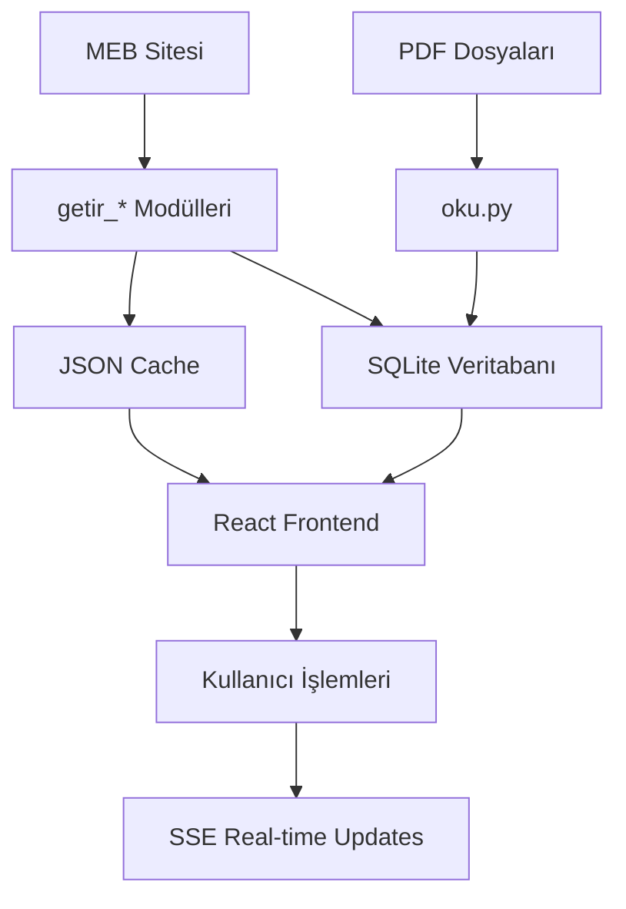

# MEB Mesleki Eğitim Veri İşleme ve Veritabanı Projesi

## Proje Hakkında

Bu proje, Türkiye Cumhuriyeti Millî Eğitim Bakanlığı'na (MEB) bağlı Mesleki ve Teknik Eğitim Genel Müdürlüğü'nün web sitesinden (`meslek.meb.gov.tr`) mesleki eğitim verilerini çekip, SQLite veritabanında yapılandırılmış şekilde saklayan ve modern bir web arayüzü ile yöneten kapsamlı bir veri işleme sistemidir.

## 🏗️ Sistem Mimarisi

Proje **3 temel katmandan** oluşur:

1. **🔧 Backend (Flask + SQLite):** Veri çekme, PDF işleme ve veritabanı yönetimi
2. **🌐 Frontend (React):** Aşamalı iş akışı ile kullanıcı arayüzü  
3. **📊 Veritabanı (SQLite):** Hiyerarşik eğitim verilerinin yapılandırılmış saklanması

### Hiyerarşik Veri Yapısı

```
Alan (Area) → Dal (Field) → Ders (Course) → Öğrenme Birimi (Learning Unit) → Konu (Topic) → Kazanım (Achievement)
```

## 📁 Dosya Yapısı ve Açıklamaları

### 🔧 Core Backend Dosyaları

- **`server.py`** - Ana Flask sunucusu, tüm API endpoint'leri ve veritabanı işlemleri

### 📊 Backend Modülleri (modules/ klasörü)

- **`modules/oku.py`** - PDF parsing ve içerik analizi (ÇÖP, DBF, DM dosyaları için)
- **`modules/getir_dbf.py`** - Ders Bilgi Formları (DBF) verilerini çeker, RAR/ZIP dosyalarını indirir ve açar ([Detaylı Kılavuz](getir_dbf.md))
- **`modules/getir_cop.py`** - Çerçeve Öğretim Programları (ÇÖP) verilerini çeker  
- **`modules/getir_dm.py`** - Ders Materyalleri (DM) verilerini çeker
- **`modules/getir_bom.py`** - Bireysel Öğrenme Materyalleri (BÖM) verilerini çeker
- **`modules/getir_dal.py`** - Alan-Dal ilişkilerini çeker

### 🌐 Frontend Dosyaları

- **`src/App.js`** - Ana React komponenti, aşamalı iş akışı UI
- **`src/App.css`** - Ana stil dosyası
- **`package.json`** - Node.js bağımlılıkları ve scriptler

### 🔧 Yardımcı Dosyalar

- **`src/index.js`** - React uygulaması entry point
- **`src/setupProxy.js`** - CORS proxy ayarları
- **`src/reportWebVitals.js`** - Performance monitoring

### 📄 Dokümantasyon

- **`README.md`** - Ana proje dokümantasyonu (bu dosya)
- **`getir_dbf.md`** - DBF (Ders Bilgi Formu) sistemi detaylı kılavuzu
- **`getir_cop.md`** - ÇÖP (Çerçeve Öğretim Programı) sistemi detaylı kılavuzu
- **`getir_dm.md`** - DM (Ders Materyali) sistemi detaylı kılavuzu
- **`getir_bom.md`** - BÖM (Bireysel Öğrenme Materyali) sistemi detaylı kılavuzu
- **`getir_dal.md`** - Alan-Dal İlişkilendirme sistemi detaylı kılavuzu
- **`WEB-UI-INTEGRATION.md`** - Web arayüzü entegrasyon kılavuzu
- **`requirements.txt`** - Python bağımlılıkları

### 🗂️ Veri Klasörleri

- **`data/`** - JSON cache dosyaları, veritabanı ve schema dosyaları
  - `temel_plan.db` - SQLite veritabanı dosyası
  - `schema.sql` - Veritabanı schema dosyası
  - `dbf/` - İndirilen DBF dosyaları (alan klasörleri halinde)
- **`modules/`** - Backend Python modülleri (veri çekme ve PDF işleme)
- **`node_modules/`** - Node.js bağımlılıkları
- **`public/`** - React public dosyaları

### 🗄️ Veritabanı Yapısı (SQLite)

Proje hiyerarşik eğitim verilerini `data/temel_plan.db` SQLite dosyasında saklar. Veriler **13 ana tablo** ile ilişkisel olarak organize edilmiştir:

#### 🔧 Otomatik Database Kurulumu

Proje **otomatik migration sistemi** ile çalışır:

1. **İlk Çalıştırma**: `python server.py` komutu ile sunucu başlatıldığında
2. **Otomatik Schema**: `data/schema.sql` dosyasından tüm tablolar otomatik oluşturulur
3. **Migration Tracking**: `schema_migrations` tablosu ile versiyon takibi
4. **Güvenli Güncellemeler**: `IF NOT EXISTS` ile çakışma önlenir

```bash
# Sunucuyu başlat - Database otomatik kurulur
python server.py

# Çıktı örneği:
# ✅ Database initialized successfully: data/temel_plan.db
# 📊 Current schema version: 1
```

#### 🔄 Manuel Database Sıfırlama

Database'i sıfırlamak için:

```bash
# 1. Veritabanı dosyasını sil
rm data/temel_plan.db

# 2. Sunucuyu yeniden başlat (otomatik yeniden oluşturur)
python server.py
```

#### 📋 Tablo Yapısı ve İlişkiler

**Ana Tablolar:**
```sql
-- 1. ALANLAR (Ana Eğitim Alanları)
temel_plan_alan
├── id (INTEGER PRIMARY KEY) - Benzersiz alan kimliği
├── alan_adi (TEXT NOT NULL) - Alan adı (ör: "Bilişim Teknolojileri")
├── meb_alan_id (TEXT) - MEB'deki resmi alan kodu
├── cop_url (TEXT) - Çerçeve Öğretim Programı URL'leri (JSON format)
├── dbf_urls (TEXT) - Ders Bilgi Formu URL'leri (JSON format)
├── created_at (TIMESTAMP) - Oluşturma zamanı
└── updated_at (TIMESTAMP) - Güncellenme zamanı

-- 2. DALLAR (Meslek Dalları)
temel_plan_dal
├── id (INTEGER PRIMARY KEY) - Benzersiz dal kimliği  
├── dal_adi (TEXT NOT NULL) - Dal adı (ör: "Yazılım Geliştirme")
├── alan_id (INTEGER) → temel_plan_alan.id (FOREIGN KEY)
├── created_at (TIMESTAMP) - Oluşturma zamanı
└── updated_at (TIMESTAMP) - Güncellenme zamanı

-- 3. DERSLER (Ders Listesi)
temel_plan_ders
├── id (INTEGER PRIMARY KEY) - Benzersiz ders kimliği
├── ders_adi (TEXT NOT NULL) - Ders adı (ör: "Python Programlama")  
├── sinif (INTEGER) - Sınıf seviyesi (9, 10, 11, 12)
├── ders_saati (INTEGER NOT NULL DEFAULT 0) - Haftalık ders saati
├── amac (TEXT) - Dersin amacı ve açıklaması
├── dm_url (TEXT) - Ders Materyali PDF URL'si
├── dbf_url (TEXT) - Ders Bilgi Formu PDF yerel dosya yolu
├── bom_url (TEXT) - Bireysel Öğrenme Materyali URL'si
├── created_at (TIMESTAMP) - Oluşturma zamanı
└── updated_at (TIMESTAMP) - Güncellenme zamanı

-- 4. DERS-DAL İLİŞKİLERİ (Many-to-Many)
temel_plan_ders_dal
├── id (INTEGER PRIMARY KEY) - Benzersiz ilişki kimliği
├── ders_id (INTEGER) → temel_plan_ders.id (FOREIGN KEY)
├── dal_id (INTEGER) → temel_plan_dal.id (FOREIGN KEY)
└── created_at (TIMESTAMP) - Oluşturma zamanı

-- 5. ÖĞRENME BİRİMLERİ (Ders Alt Bölümleri)
temel_plan_ogrenme_birimi  
├── id (INTEGER PRIMARY KEY) - Benzersiz birim kimliği
├── ders_id (INTEGER) → temel_plan_ders.id (FOREIGN KEY)
├── birim_adi (TEXT NOT NULL) - Öğrenme birimi adı
├── sure (INTEGER) - Süre (saat)
├── aciklama (TEXT) - Birim açıklaması
├── sira (INTEGER) - Sıralama
├── created_at (TIMESTAMP) - Oluşturma zamanı
└── updated_at (TIMESTAMP) - Güncellenme zamanı

-- 6. KONULAR (Öğrenme Birimi Konuları)
temel_plan_konu
├── id (INTEGER PRIMARY KEY) - Benzersiz konu kimliği  
├── ogrenme_birimi_id (INTEGER) → temel_plan_ogrenme_birimi.id (FOREIGN KEY)
├── konu_adi (TEXT NOT NULL) - Konu başlığı
├── detay (TEXT) - Konu detayları
├── sira (INTEGER) - Sıralama
├── created_at (TIMESTAMP) - Oluşturma zamanı
└── updated_at (TIMESTAMP) - Güncellenme zamanı

-- 7. KAZANIMLAR (Öğrenme Hedefleri)
temel_plan_kazanim
├── id (INTEGER PRIMARY KEY) - Benzersiz kazanım kimliği
├── konu_id (INTEGER) → temel_plan_konu.id (FOREIGN KEY)  
├── kazanim_adi (TEXT NOT NULL) - Kazanım tanımı
├── seviye (TEXT) - Kazanım seviyesi (Temel, Orta, İleri)
├── kod (TEXT) - Kazanım kodu
├── sira (INTEGER) - Sıralama
├── created_at (TIMESTAMP) - Oluşturma zamanı
└── updated_at (TIMESTAMP) - Güncellenme zamanı
```

**Destek Tabloları:**
```sql
-- 8. ARAÇ-GEREÇ (Ders Araçları)
temel_plan_arac
├── id (INTEGER PRIMARY KEY) - Benzersiz araç kimliği
├── arac_adi (TEXT NOT NULL UNIQUE) - Araç adı
├── kategori (TEXT) - Araç kategorisi (Yazılım, Donanım, Malzeme)
├── aciklama (TEXT) - Araç açıklaması
├── created_at (TIMESTAMP) - Oluşturma zamanı
└── updated_at (TIMESTAMP) - Güncellenme zamanı

-- 9. DERS-ARAÇ İLİŞKİLERİ (Many-to-Many)
temel_plan_ders_arac
├── id (INTEGER PRIMARY KEY) - Benzersiz ilişki kimliği
├── ders_id (INTEGER) → temel_plan_ders.id (FOREIGN KEY)
├── arac_id (INTEGER) → temel_plan_arac.id (FOREIGN KEY)
├── miktar (INTEGER DEFAULT 1) - Gerekli miktar
├── zorunlu (BOOLEAN DEFAULT 0) - Zorunlu mu?
└── created_at (TIMESTAMP) - Oluşturma zamanı

-- 10. ÖLÇME DEĞERLENDİRME (Assessment Methods)
temel_plan_olcme
├── id (INTEGER PRIMARY KEY) - Benzersiz ölçme kimliği
├── olcme_adi (TEXT NOT NULL UNIQUE) - Ölçme yöntemi adı
├── aciklama (TEXT) - Açıklama
├── agirlik_yuzdesi (INTEGER) - Ağırlık yüzdesi
├── created_at (TIMESTAMP) - Oluşturma zamanı
└── updated_at (TIMESTAMP) - Güncellenme zamanı

-- 11. DERS-ÖLÇME İLİŞKİLERİ (Many-to-Many)
temel_plan_ders_olcme
├── id (INTEGER PRIMARY KEY) - Benzersiz ilişki kimliği
├── ders_id (INTEGER) → temel_plan_ders.id (FOREIGN KEY)
├── olcme_id (INTEGER) → temel_plan_olcme.id (FOREIGN KEY)
├── agirlik_yuzdesi (INTEGER DEFAULT 0) - Bu derste ağırlık yüzdesi
└── created_at (TIMESTAMP) - Oluşturma zamanı

-- 12. DERS AMAÇLARI (Course Objectives)
temel_plan_ders_amac
├── id (INTEGER PRIMARY KEY) - Benzersiz amaç kimliği
├── ders_id (INTEGER) → temel_plan_ders.id (FOREIGN KEY)
├── amac (TEXT NOT NULL) - Amaç açıklaması
├── sira (INTEGER) - Sıralama
├── created_at (TIMESTAMP) - Oluşturma zamanı
└── updated_at (TIMESTAMP) - Güncellenme zamanı

-- 13. MIGRATION TABLOSU (Schema Versioning)
schema_migrations
├── version (INTEGER PRIMARY KEY) - Schema versiyonu
└── applied_at (TIMESTAMP DEFAULT CURRENT_TIMESTAMP) - Uygulama zamanı
```

#### 🔗 İlişkisel Yapı

```
Alan (1) ←→ (N) Dal ←→ (M) Ders ←→ (N) Öğrenme Birimi ←→ (N) Konu ←→ (N) Kazanım
     ↓              ↓         ↓              ↓              ↓         ↓
   58 Alan      ~180 Dal   ~800 Ders     ~2000 Birim    ~5000 Konu  ~8000 Kazanım
```

#### 📊 Veri Akışı ve Kaynak Entegrasyonu

- **`modules/getir_dm.py`** → `temel_plan_alan` + `temel_plan_dal` + `temel_plan_ders` (dm_url)
- **`modules/getir_cop.py`** → `temel_plan_alan` (cop_url) + ÇÖP PDF işleme  
- **`modules/getir_dbf.py`** → `temel_plan_alan` (dbf_urls) + `temel_plan_ders` (ders_saati)
- **`modules/oku.py`** → Tüm tablolar (PDF'den ders içeriği çıkarımı)

#### 🔍 Örnek Sorgular

```sql
-- Alan bazında ders sayısı
SELECT a.alan_adi, COUNT(DISTINCT d.id) as ders_sayisi 
FROM temel_plan_alan a
JOIN temel_plan_dal da ON a.id = da.alan_id  
JOIN temel_plan_ders_dal dd ON da.id = dd.dal_id
JOIN temel_plan_ders d ON dd.ders_id = d.id
GROUP BY a.id;

-- Sınıf bazında toplam ders saati
SELECT sinif, SUM(ders_saati) as toplam_saat
FROM temel_plan_ders 
GROUP BY sinif;

-- Öğrenme birimi detayları ile ders listesi  
SELECT d.ders_adi, ob.birim_adi, k.konu_adi, COUNT(ka.id) as kazanim_sayisi
FROM temel_plan_ders d
JOIN temel_plan_ogrenme_birimi ob ON d.id = ob.ders_id
JOIN temel_plan_konu k ON ob.id = k.ogrenme_birimi_id  
JOIN temel_plan_kazanim ka ON k.id = ka.konu_id
GROUP BY d.id, ob.id, k.id;
```

## 🚀 Kurulum ve Çalıştırma

### Gereksinimler

- Python 3.8+
- Node.js 16+
- SQLite3

### 1. Backend Kurulumu

```bash
# Python sanal ortam oluştur
python -m venv venv
source venv/bin/activate  # macOS/Linux
# venv\Scripts\activate   # Windows

# Bağımlılıkları yükle
pip install -r requirements.txt

# Flask sunucusu başlat
python server.py
```

### 2. Frontend Kurulumu

```bash
# Node.js bağımlılıklarını yükle
npm install

# React dev server başlat
npm start
```

## 🔄 Aşamalı İş Akışı

Proje **3 ana adımda** organize edilmiştir:

### 🚀 Adım 1: Temel Veri Çekme
- **Verileri Çek:** MEB sitesinden ana veri çekme
- **DBF Getir:** Ders Bilgi Formu linklerini çek
- **ÇÖP Getir:** Çerçeve Öğretim Programı linklerini çek
- **DM Getir:** Ders Materyali linklerini çek
- **BÖM Getir:** Bireysel Öğrenme Materyali linklerini çek

### 📄 Adım 2: PDF İşleme ve Analiz
- **DBF İndir ve Aç:** RAR/ZIP dosyalarını otomatik işle
- **ÇÖP PDF'lerini İşle:** PDF içeriklerini analiz et ve veritabanına kaydet
- **Tüm PDF'leri Tekrar İşle:** Başarısız işlemleri yeniden dene

### 💾 Adım 3: Veritabanı Güncellemeleri
- **DBF Eşleştir:** İndirilen dosyalarla dersleri eşleştir
- **Ders Saatlerini Güncelle:** DBF'lerden ders saati bilgilerini çıkar
- **Veritabanına Aktar:** Düzenlenmiş dersleri kaydet

## 🔌 API Endpoints

### Veri Çekme
- `GET /api/get-cached-data` - Önbellekteki verileri getir
- `GET /api/scrape-to-db` - MEB sitesinden veri çek ve veritabanına kaydet (SSE)
- `POST /api/process-pdf` - PDF dosyasını işle (SSE)

### Kategorik Veri
- `GET /api/get-dbf` - DBF verilerini getir
- `GET /api/get-cop` - ÇÖP verilerini getir  
- `GET /api/get-dm` - DM verilerini getir
- `GET /api/get-bom` - BÖM verilerini getir

### PDF ve DBF İşlemleri
- `GET /api/dbf-download-extract` - DBF dosyalarını indir ve aç (SSE)
- `GET /api/dbf-retry-extract-all` - Tüm DBF'leri tekrar aç (SSE)
- `POST /api/process-cop-pdfs` - ÇÖP PDF'lerini işle ve veritabanına kaydet (SSE)
- `POST /api/update-ders-saatleri-from-dbf` - DBF'lerden ders saatlerini güncelle (SSE)

### Veritabanı
- `POST /api/dbf-match-refresh` - DBF eşleştirmesini güncelle
- `POST /api/export-to-database` - Düzenlenmiş dersleri veritabanına aktar

## 📊 Veri Akışı



## 🎯 Çekilen Veri Türleri

- **🏢 Alanlar:** Mesleki eğitim alanları (58 alan)
- **🎓 Dallar:** Meslek dalları (alan başına 1-8 dal)
- **📚 Dersler:** Ders listesi ve detayları
- **📄 DBF:** Ders Bilgi Formları (RAR/ZIP dosyaları)
- **📋 ÇÖP:** Çerçeve Öğretim Programları (PDF dosyaları)
- **📖 DM:** Ders Materyalleri (PDF linkleri)
- **📚 BÖM:** Bireysel Öğrenme Materyalleri

## 🔧 Teknoloji Yığını

**Backend:**
- Python 3.8+
- Flask (Web framework)
- SQLite3 (Veritabanı)
- Requests + BeautifulSoup4 (Web scraping)
- pdfplumber (PDF parsing)

**Frontend:**
- React 18
- Modern JavaScript (ES6+)
- CSS3 (Responsive design)
- Server-Sent Events (Real-time updates)

## 🏆 Özellikler

- ✅ **Real-time Progress:** SSE ile canlı işlem takibi
- ✅ **Aşamalı İş Akışı:** Organize edilmiş 3-adımlı süreç  
- ✅ **Otomatik PDF İşleme:** Batch PDF analizi
- ✅ **Hata Toleransı:** Başarısız işlemler için retry mekanizması
- ✅ **Veritabanı Tabanlı:** SQLite ile yapılandırılmış veri saklama
- ✅ **Responsive UI:** Modern ve kullanıcı dostu arayüz
- ✅ **Önbellekleme:** Hızlı veri erişimi için cache sistemi

## 🚨 Önemli Notlar

- DBF dosyaları büyük boyutlu olabilir, indirme süresi değişkendir
- PDF işleme CPU yoğun operasyon, zaman alabilir
- MEB sitesi yapısı değişirse veri çekme modülleri güncelleme gerektirebilir
- Veritabanı dosyası (`data/temel_plan.db`) otomatik oluşturulur

## 📄 Lisans

Bu proje MIT Lisansı altında lisanslanmıştır.

---

🔗 **MEB Kaynak:** https://meslek.meb.gov.tr/  
📧 **Destek:** Projeyle ilgili sorular için issue açabilirsiniz